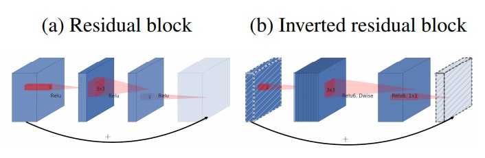

# MobileNet-summary-Z
MobileNet is a mobile classification network proposed by Google

## MobileNet V1
在V1中, MobileNet应用了深度可分离卷积(Depth-wise Seperable Convolution)并提出两个超参来控制网络容量，这种卷积背后的假设是跨channel相关性和跨spatial相关性的解耦。深度可分离卷积能够节省参数量省，在保持移动端可接受的模型复杂性的基础上达到了相当的高精度。

## MobileNet V2
在V2中，MobileNet应用了新的单元：Inverted residual with linear bottleneck，主要的改动是为Bottleneck添加了linear激活输出以及将残差网络的skip-connection结构转移到低维Bottleneck层。

### 1. Inverted residual:

First, we increase the feature maps channels through $1 \times 1$ conv2d, then we use $3 \times 3$ separable_conv2d for feature extraction, finally we resize the feature map channels and get the feature maps

    

    

### 2. Linear bottlenecks

In order to avoid the information loss caused by relu function, remove the relu6 function before elementwise sum in the residual block.

为了避免Relu对特征的破坏，在residual block的Eltwise sum之前的那个 1*1 Conv 不再采用Relu6，而是直接线性输出，作者说这样可以避免Relu对特征的破坏同时保留更多的特征参数，提高模型准确率。

### 3. Model architecture

    

    

### 4. ReLU 6
在移动端设备float16的低精度的时候，也能有很好的数值分辨率，如果对ReLU的激活范围不加限制，输出范围为0到正无穷，如果激活值非常大，分布在一个很大的范围内，则低精度的float16无法很好地精确描述如此大范围的数值，带来精度损失。

    

### 5. Operation numbers

Normal convolution:
Input shape: $h_{in} \times w_{in} \times c_{in}$
Kernel size: $h_{k} \times w_{k} \times c_{in} \times c_{out}$
Output shape: $h_{out} \times w_{out} \times c_{out}$
operations: $h_{k} \times w_{k} \times c_{in} \times c_{out} \times h_{out} \times w_{out}$

Depthwise convolution:
Input shape: $h_{in} \times w_{in} \times c_{in}$
Kernel size: $h_{k} \times w_{k} \times c_{in} $
Output shape: $h_{out} \times w_{out} \times c_{in}$
operations: $h_{k} \times w_{k} \times c_{in} \times h_{out} \times w_{out}$

Pointwise convolution:
Input shape: $h_{in} \times w_{in} \times c_{in}$
Kernel size: $1 \times 1 \times c_{in} \times c_{out}$
Output shape: $h_{out} \times w_{out} \times c_{out}$
operations: $1 \times 1 \times c_{in} \times c_{out} \times h_{out} \times w_{out}$

Total operations: ($h_{k} \times w_{k} \times c_{in} \times h_{out} \times w_{out}$ +  $1 \times 1 \times c_{in} \times c_{out} \times h_{out} \times w_{out}$) $<$ $h_{k} \times w_{k} \times c_{in} \times c_{out} \times h_{out} \times w_{out}$